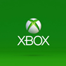
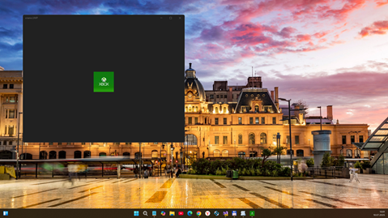
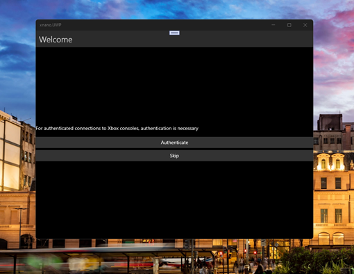
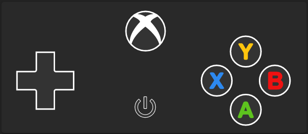

# xbox-client-xamarin 1.0-pre-pre-pre-alpha - master branch 



My fork of xbox-client-xamarin, Xbox one gamestreaming app for Android & iOS.

" Dream(ing) on adding "Windows OneCore" (UWP)… " =)

## About
- Xamarin.Forms multi platform gamestreaming client app
- UWP Target: Draft / Not ready (when Authenticate button clicked, app crashes)

## Screenshots




## My 2 cents
- xnano.UWP project added
- Min. Win. SDK build = 16299

## Dependencies
- Xamarin
- VS 2017 / 2019 / 2022 or VS for Mac

## Build from source
```sh
git clone --recursive https://github.com/mediaexplorer74/xbox-client-xamarin
```

## TODO
- Explore https://github.com/OpenXbox/ community (dev team / group) , especially https://github.com/OpenXbox/xbox-client-ffmpeg
- Realize renders for xnano.UWP  

## References
- https://github.com/OpenXbox/xbox-client-xamarin Xbox one gamestreaming app for Android & iOS
- https://github.com/rotorgames/Rg.Plugins.Popup/wiki/Getting-started Rg.Plugins.PopUps How-to / Getting started
- https://github.com/OpenXbox/smartglass-documentation Documentation of the Xbox One SmartGlass protocol
- https://github.com/OpenXbox/xbox-smartglass-csharp .NET Standard client library for the Xbox One SmartGlass protocol
- https://github.com/OpenXbox/xbox-webapi-csharp C# Xbox WebAPI, includes support for authentication with Windows Live / Xbox Live
- https://github.com/OpenXbox/xbox-client-ffmpeg Multi-platform Gamestreaming app ?


## Support
Currently none, project is work-in-progress

## .
[M][E]


